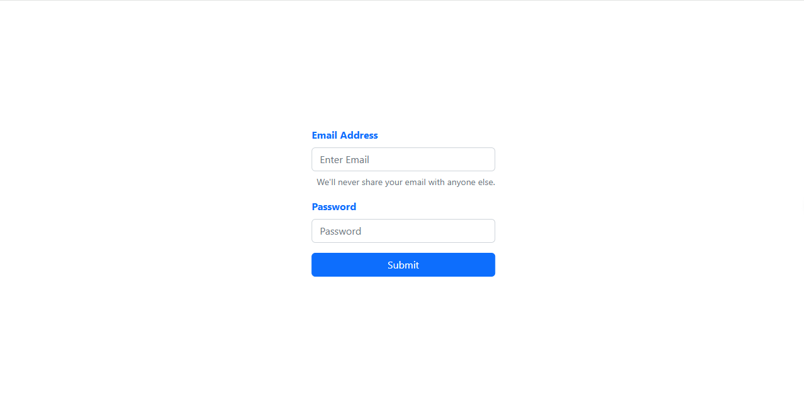

# form-validation-without-formik-iti 

in this small project i tried to create a form-validation-without-formik built with ReactJs [hooks] and react-bootstrap. just for learning and practice.

## Table of contents

- [Overview](#overview)
- [Features](#Features)
- [Components](#Components)
     - [App](#App)
     - [FormPage](#FormPage)
     - [Sent](#Sent)
- [Installation](#Installation)
- [Usage](#Usage)
- [Links](#Links)
- [Screenshot](#Screenshot)
- [What I learned](#what-i-learned)
- [Continued development](#continued-development)
- [Author](#author)
- [Acknowledgments](#Acknowledgments)


## overview
in this small project i tried to create a form-validation-without-formik built with ReactJs [hooks] and react-bootstrap. just for learning and practice. it allow user to add his email and password . if both are true then the form supmitted and he recives a photo

## Features
- two inputs,submit button , photo

## Components

### App

The main component that has a FormPage,Sent.

### FormPage

the component that holds the whole logic of form and errors.

### Sent

the component that show on screen a photo when the form submitted successfully.

## Installation
To get started with this project, follow these steps:

you can clone the project or download it as Zip file.
1. Clone the repository:
   ```bash
   git clone https://github.com/olahasan/prayers-timings-react-hooks-tarmez

2. Navigate to the project directory:
   cd <project-directory>

3. Install the required dependencies:
   npm install   


## Usage
To run the application, use the following command:

npm start


## Links

If you want to open the link in a new tab, you can:

- Press **Ctrl** (or **Cmd** on Mac) while clicking the link.
- Right-click the link and select **Open link in new tab**.

Otherwise, all links will open in the same tab.


- Solution URL: [here](https://github.com/olahasan/form-validation-without-formik-iti) 

- Live Site URL: [here](https://form-validation-without-formik-iti.netlify.app/) 

 ## Screenshot
 



## what-i-learned
Through this project:
1. I learned in this simple project how to create react app and treat with function component,
2. how to deal with **Hooks**
6. how to deal with **react-bootstrap**
7. how to deploy it on **netlify**

## Continued Development
In the future, I plan to:
- learn reactJs Hooks.
- learn more about reactJs Hooks,material ui,react-bootstrap.

### Author

GitHub - @olahasan

### Acknowledgments

I would like to thank the **[iti](iti)** for providing this challenge and to the community for their support.

